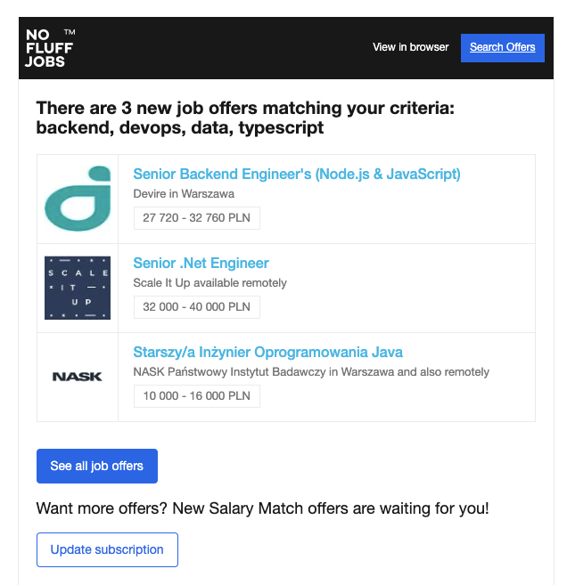
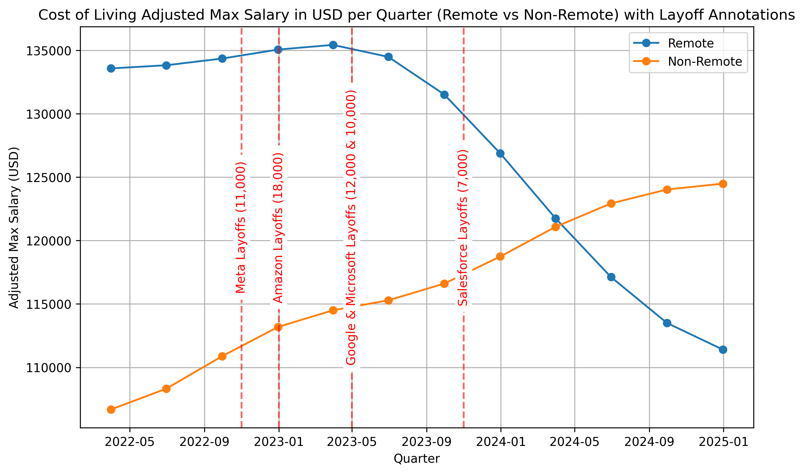

# I pulled job data from my inbox to see if there was a trend

I set up email alerts from No Fluff Jobs a few years ago. Every day I have been getting several of these per day and I've always thought there might be away to extract some kind of trend from them.



So I did that and these were the results. [You can read about it here in my blog post.](https://blog.sc.ott.land)



[Or Just check out the Python Notebook with the results](./job_data.ipynb)

## Set up

1. install uv

2. Install dependencies & set up the venv

```
uv sync

uv venv

source .venv/bin/activate
```

3. Auth to GCP so you can use Gemini (you have to enable Vertex AI)

```bash
gcloud auth application-default login
```

## How I ran this (you probably shouldn't becuase you don't have the data in your gmail.)

1. Get all of the data you want to parse from Google Takeout, download that file

2. Put the mbox from Google Takeout here `tmp/Takeout/Mail/No Fluff Jobs.mbox`

3. Pull the emails out, strip the HTML, get the jobs out with an LLM, and put them all into 1 CSV

```bash
./1_pull_out_text_from_mbox.py

./2_html_to_markdown.py

./3_get_jobs_with_llm.py

./4_put_it_into_a_csv.py
```

3. Open up the jupyter notebook `uv run jupyter notebook` look at `job_data.ipynb`
